# 现代WEB安全的情况

## 服务端安全:

### 命令注入:
基本杜绝;审计的成本很低,往往发生在开源组件和web组件中
    
### SQL注入:
基本杜绝;通过预编译+ORM可以基本可以完全避免,但**部分SQL语句无法预编译**,这部分可以分析下哪些场景会有作为侧重点
    
### 文件上传:
很难成功;现在不少企业使用了云存储,上传的文件并不是在webapp下,导致上传的脚本无法渲染

### 文件下载:
很难成功;由于云存储获取文件通常是用fileid,并不是文件名,即便获得了也只是文件系统上的文件,以getshell为目的那么用途并不大；重点可以关注下**能下载到web服务器**的情况,配合文件上传有可能getshell

### XXE:很少见;
目前还是直接通过XML传输到服务器的场景很少,基本都是json为主

### SSRF:
很难成功;httprequest这种场景虽然很常见,不过防御成本很低,一个白名单即可，侧重点应该在**白名单的绕过**

### SSTI:
基本杜绝;前后端分离不涉及html渲染,不存在这类问题

### 反序列化:
学习成本高但收益高;目前java最常见的漏洞之一,但是原理比较复杂，利用链也复杂,可以作为**学习投入的重点**

### JNDI注入:
暂时未知;java常见漏洞之一,类似JDBC类似,可以作为**学习投入的重点**

### 表达式注入:
未知;和SSTI类似,目前最常见的web漏洞之一,可以作为**学习投入的重点**

### 敏感信息泄露:
学习成本低收益高;目前常见的web漏洞之一,可以作为**学习投入的重点**

### 越权:
学习成本低收益高;目前常见的web漏洞之一,可以作为**学习投入的重点**

## 客户端安全

### XSS:
依旧问题严重,但攻击成本提高;目前最常见通用漏洞没有之一,虽然用安头部+输入输出转义能解决大部分问题,但是由于其处理情况复杂,所以**依旧可以投入研究**,重点:各种绕过姿势,前端框架的使用

### CSRF:
情况不了解;安全头部能解决很大部分问题,**依旧可以投入研究**,重点:绕过知识

# 工具

## 代码扫描

### CodeQL

ref：

https://blog.csdn.net/god_zzZ/article/details/123475723

#### 0x00 前言


最近这个东西实在太火了，而且log4j 和最近的Spring Cloud Gateway 都说是利用codeql来挖掘的，好不好用先用了再说。所以学习一下这个东西
　 

#### 0x01 CodeQL是什么


在我接触这个东西之前，我一直以为这是一个代码审计的工具，类似于Fortify rips 这种东西？
　
但其实并不是，理解大大错了。。。

还记得记得SQL的全称吗？ -> Structured Query Language:结构化查询语言

所以我简单通俗的理解就是：

- Codeql = code + ql，这样就是一门面向对象的编程语言（对比SQL）

- . 是把代码结构化分析后的存在一个代码数据库里面
- 然后就是写ql就可以进行各种查询
- 找某个方法、类、参数的传递等等。。。

神奇。。

官方地址：

https://github.com/github/codeql

 

#### 0x01 相关下载


CodeQL本身包含两部分解析引擎+SDK

我推荐直接下载这个！可以直接配合 vscode 的现成项目，使用方便。

https://github.com/github/vscode-codeql-starter

（注意下载的时候不能直接git clone，因为里面包含子项目

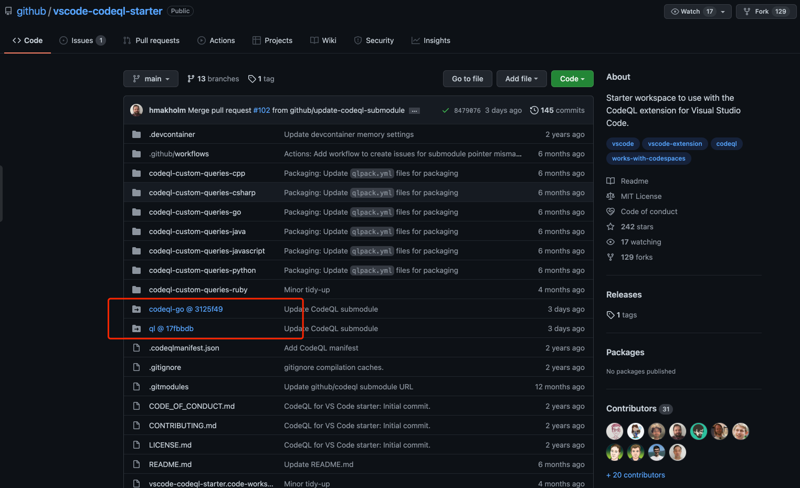

​        

#### 0x02 安装详细步骤        

我这边推荐使用 vscode-codeql-starter 这个现成的项目，使用起来很方便

##### 1、vscode 环境

首先需要在官网下载并安装Visual Studio Code

- 安装codeql插件：


​       

##### 2 安装 CodeQL 引擎

引擎二进制文件下载 ：

https://github.com/github/codeql-cli-binaries/releases

（推荐直接下载codeql.zip 这个是多平台都打包在一起）

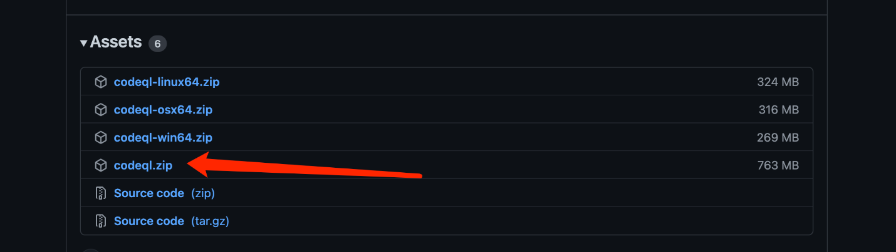

​        

##### 3 克隆工作车间 Codeql starter

这个项目里的 submodule 也须要 Clone

使用下面命令一步到位

git clone --recursive https://github.com/github/vscode-codeql-starter/
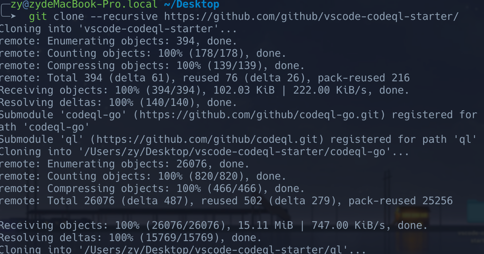

(如果子模块clone失败，可以自己下载放进去也行)

​        

##### 4 配置环境变量

1 、在 VSCode 菜单中点击 `File > Open Workspace` 选择 `vscode-codeql-starter.code-workspace` 这个文件来打开这个工作区。

2、找到插件的扩展设置

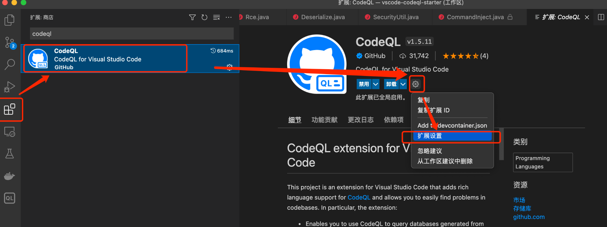

3、设置引擎地址

这里面添加引擎刚刚下载的 CodeQL 引擎的可执行文件

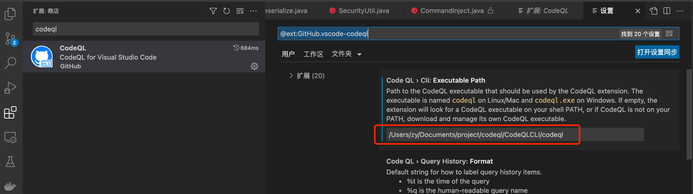

就是codeql.zip 解压后对于系统的可执行文件地址

 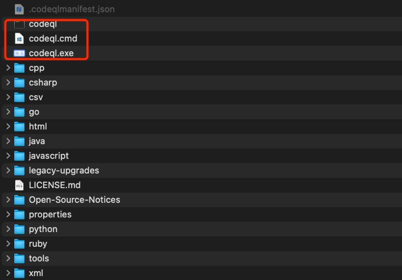

##### 5 系统环境变量添加

为了方便后面使用codeql，还需要把刚刚那个添加到系统里面

我是Mac 就是这样

```shell
vim ~/.zshrc
alias codeql="/Users/zy/Documents/project/codeql/CodeQLCLI/codeql"
```


windows 就和添加Java环境变量一样，设置一个path到刚刚到codeql.exe 那个目录就行了

到这里环境应该就是好了，下一步就是建立数据库了（或导入数据库）

  

#### 0x03 创建数据库（Java）

打开终端使用 codeql命令

```shell
codeql database create [数据库存的路径]  --language="java"  --command="mvn clean install --file pom.xml" --source-root=[源码路径路径]
```


例如我的用的这个项目作为审计的目标 https://github.com/godzeo/java-sec-code

```shell
codeql database create /Users/zy/Documents/project/codeql/vscode-codeql-starter-main/database/codeql_java-sec-code  --language="java"  --command="mvn clean install --file pom.xml" --source-root=/Users/zy/Documents/project/sec_java_vul/java-sec-code
```


然后把这个命令拆解看一下

`codeql database create java-database`	创建数据库，名字为`codeql_java-sec-code`
`-language=java`	编译语言为java
`-command=“mvn clean install --file pom.xml”`	利用命令进行源码编译
`–source-root`	设置源码的路径
成功建库

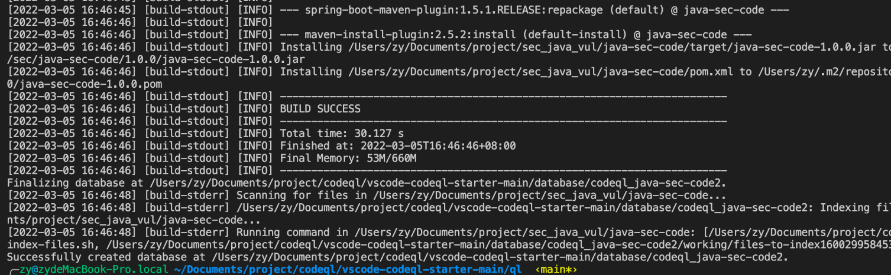

 

#### 0x04 导入库进行查询


在vscode里面找到 导入数据库

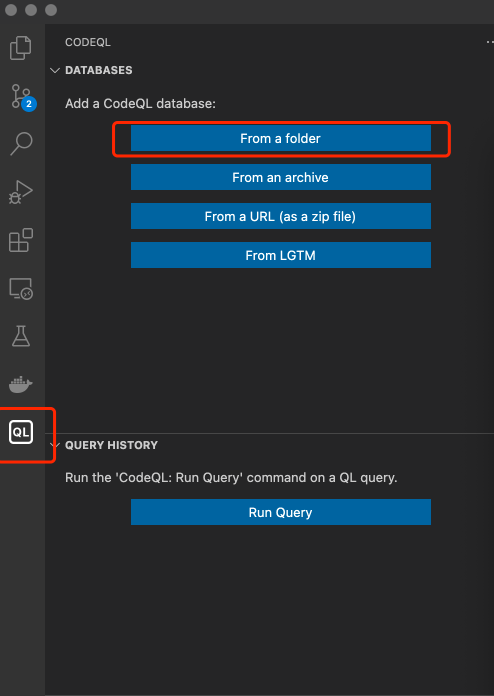

这样就是导入成功了

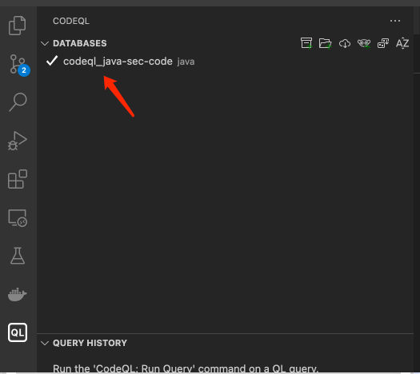

下面开始查询：

```shell
跟目录/ql/java/ql/src/Security                 放着一些官方的规则(java)，可直接用。
这跟目录/ql/java/ql/src/experimental/Security  一些还在实验中的规则(java)。
```


找到规则文件试一下，xss.ql 文件 ，右键 Run Query

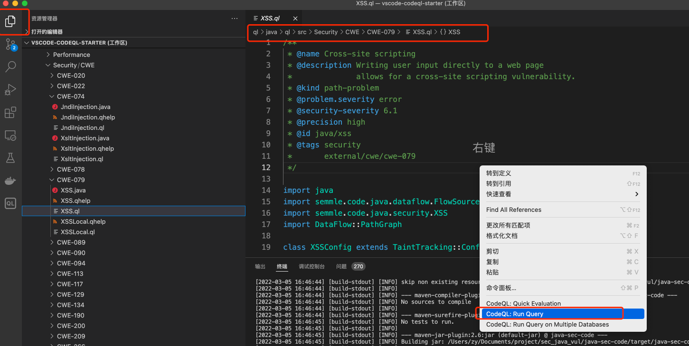

出结果了，跑通了这就是

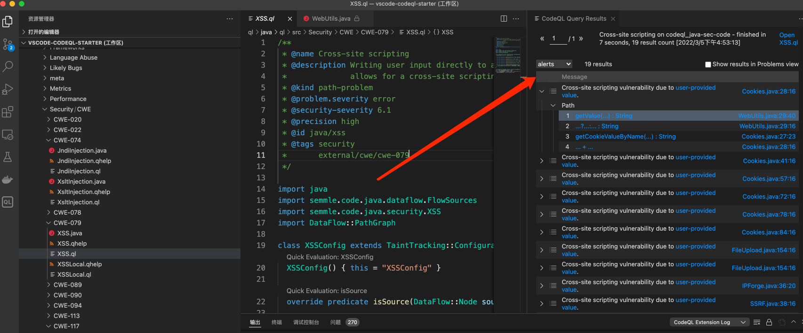

然后点一下就找到了漏洞点了。

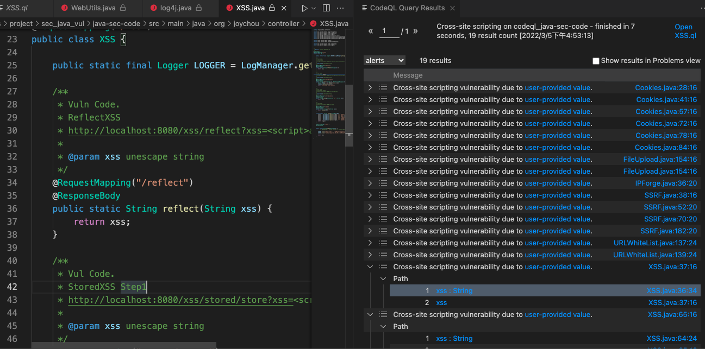


## 漏扫

aW9\EAT$HpF83(d74?iL5=45%a]Z~Y5*
# WebSec
